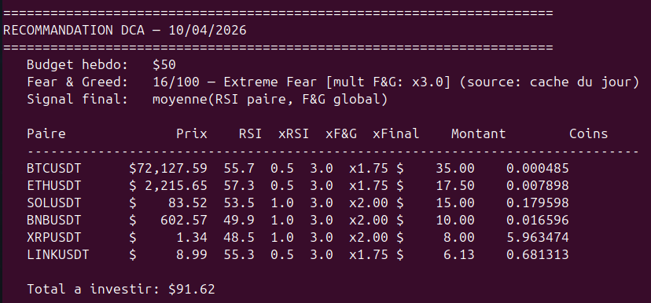

# DCA Intelligent

Smart **Dollar Cost Averaging** bot for crypto — weekly buys dynamically adjusted by a combined **RSI + Fear & Greed Index** signal. Core-Satellite strategy on 6 Binance pairs, with full French tax logging (PMP, form 2086).

> ⚠️ Educational project. Not financial advice.

## 🛠️ Tech Stack

[](https://www.python.org/)
[](https://numpy.org/)
[](https://pandas.pydata.org/)
[](https://binance-docs.github.io/apidocs/)

### Sample output



## 🎯 Strategy

### Core-Satellite Allocation

**Core (75%)** — long-term conviction picks

| Asset | Weight | Thesis |
|-------|--------|--------|
| BTC   | 40%    | Store of value, institutional ETFs |
| ETH   | 20%    | Smart contracts, DeFi, L2 ecosystem |
| SOL   | 15%    | High-performance L1, ETH challenger |

**Satellite (25%)** — targeted, more speculative bets

| Asset | Weight | Thesis |
|-------|--------|--------|
| BNB   | 10%    | Strong perf + 25% Binance fee discount |
| XRP   | 8%     | Banking adoption, top 5 market cap, SEC case resolved |
| LINK  | 7%     | DeFi oracles, real revenue, essential infrastructure |

### Combined Signal: RSI + Fear & Greed

The amount invested is determined by the **average of two signals**:

**RSI (per pair, 14-period 1h)** — individual technical signal

| RSI      | Zone        | Multiplier |
|----------|-------------|------------|
| < 30     | Panic       | ×3.0       |
| 30 – 45  | Depressed   | ×2.0       |
| 45 – 55  | Neutral     | ×1.0       |
| 55 – 70  | Optimistic  | ×0.5       |
| > 70     | Euphoria    | ×0.0       |

**Fear & Greed Index (global, daily)** — market sentiment ([alternative.me](https://alternative.me/crypto/fear-and-greed-index/))

| F&G      | Zone           | Multiplier |
|----------|----------------|------------|
| < 25     | Extreme fear   | ×3.0       |
| 25 – 45  | Fear           | ×2.0       |
| 45 – 55  | Neutral        | ×1.0       |
| 55 – 75  | Greed          | ×0.5       |
| > 75     | Extreme greed  | ×0.0       |

**Final multiplier = (xRSI + xF&G) / 2**

> Example: RSI=72 (euphoria, ×0) + F&G=8 (extreme fear, ×3) → ×1.5 → still buy because the broader market is panicking even though this pair has rallied.

If the F&G API is down, the script falls back to the cached value, then to RSI-only as a last resort.

## 📊 Backtest (Mar 2022 → Mar 2026, $25/week)

Tested across 4 distinct market phases to avoid overfitting:

| Strategy                            | Invested | Final value | Performance |
|-------------------------------------|----------|-------------|-------------|
| Equal weights, RSI only             | $6,554   | $8,355      | +27.5%      |
| old config, RSI only                | $6,398   | $9,203      | +43.8%      |
| RSI only                            | $6,389   | $10,184     | +59.4%      |
| **RSI + F&G combined**              | **$6,694** | **$11,017** | **+64.6%**  |
| F&G only (reference)                | $7,000   | $11,851     | +69.3%      |
 
Per-phase breakdown (v7 combined signal):
 
| Phase          | Period      | Perf    |
|----------------|-------------|---------|
| Crypto Winter  | 2022 → 2023 | -29.0%  |
| Recovery       | 2023 → 2024 | +96.5%  |
| Bull Run       | 2024 → 2025 | +65.7%  |
| Post-ATH       | 2025 → 2026 | -27.3%  |

## 🚀 Getting Started

**Requirements**: Python 3.10+

```bash
git clone https://github.com/Babou38/dca-intelligent.git
cd dca-intelligent

python -m venv .venv
source .venv/bin/activate
pip install -r requirements.txt

# One-time: download 4 years of historical data (~3-5 min, ~33 MB)
python download_4y.py
```

## 💻 Usage

```bash
# Weekly recommendation (auto-updates market data)
python dca_production.py recommend

# Record buys (with confirmation prompt)
python dca_production.py buy

# Record a sell — auto-computes capital gains via PMP
python dca_production.py sell BTCUSDT 0.005 90000

# Portfolio status (holdings + average cost per asset)
python dca_production.py status

# Yearly tax report
python dca_production.py tax 2025

# Run the 4-year backtest
python dca_production.py backtest
```

## 🇫🇷 French Tax Compliance

Uses the **Weighted Average Cost (PMP)** method, compliant with French regulation:

- PMP recalculated on every **buy**
- PMP unchanged on **sell**
- Capital gain = (sell price − PMP) × quantity − fees
- Flat tax 30% (12.8% income tax + 17.2% social charges)
- Exported as CSV ready for **form 2086** (cerfa)

## 📁 Generated Files

| File                  | Description                                          |
|-----------------------|------------------------------------------------------|
| `dca_log.json`        | All transactions (buys, sells, fees, notes)          |
| `dca_fiscal.csv`      | Full transaction export with PMP                     |
| `dca_fiscal_2025.csv` | Year-filtered export (via `tax` command)             |
| `fng_cache.json`      | Daily F&G cache (fallback if API down)               |
| `data_4y/`            | OHLCV market data (one CSV per pair, auto-updated)   |

## ⚙️ Configuration

All parameters live at the top of `dca_production.py`:

```python
WEEKLY_BUDGET = 50.0          # Weekly budget in USD

PORTFOLIO_WEIGHTS = {         # Core-Satellite weights
    'BTCUSDT':  0.40,
    'ETHUSDT':  0.20,
    ...
}

RSI_MULTIPLIERS = [           # RSI thresholds and multipliers
    (30, 3.0),
    (45, 2.0),
    ...
]

BINANCE_FEE_PCT = 0.075       # Binance fee (0.075% with BNB)
```

---

*Personal project — built to learn quantitative strategies, backtesting, and tax accounting in Python.*
